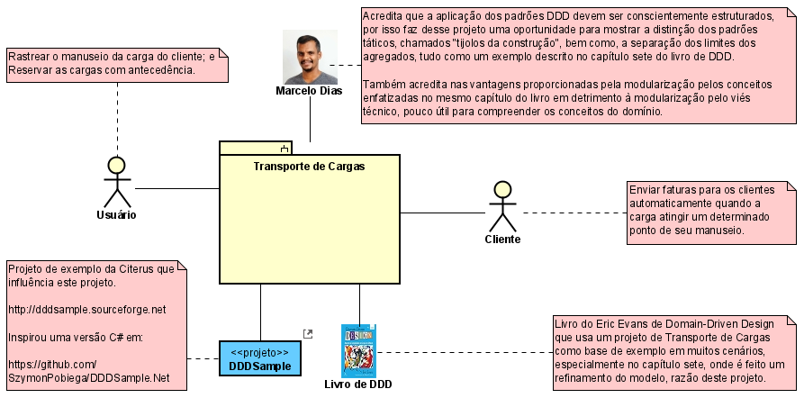
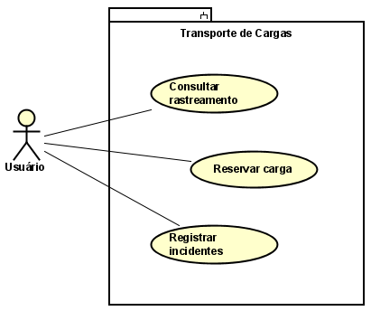
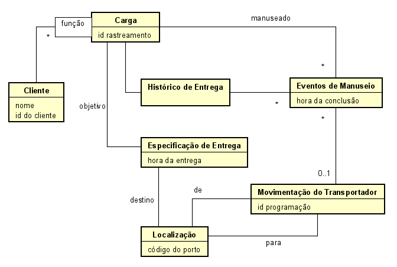

# Transporte de Cargas

## Casos de Uso

### Contexto do Sistema

### Módulo de Transporte de Cargas

- "Vários **Clientes** estão envolvidos com uma **Carga**, cada qual desempenhando uma _função_ diferente".
- "O _objetivo_ de entrega da **Carga** é _especificado_".
- "Uma série de **Movimentações do Transportador** satisfazendo a **Especificação** vai cumprir o _objetivo_ da entrega".
